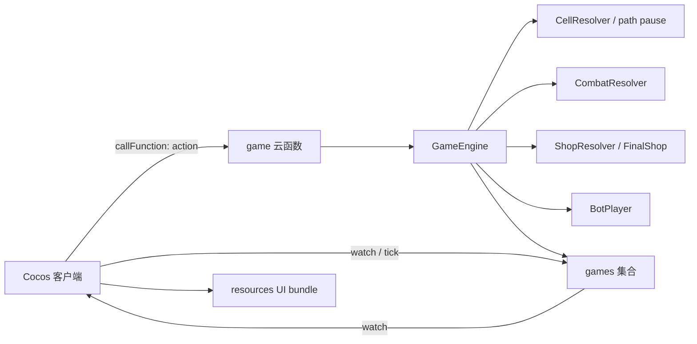

---
projects:
  - CoupleGame: assets/**, cloudfunctions/**, shared/**
status: active
created: 2026-05-29
updated: 2026-06-05
---

# 当前玩法设计文档

## 1. 背景与目标

当前游戏是微信联机派对棋，核心循环为「跑图发育 → 获取装备/道具 → 追击或防守 → 淘汰对手」。玩家通过棋盘移动、资源获取、商店购买、事件格互动、道具与攻击形成对抗，目标是成为最后存活者。

本文档是当前玩法规则的唯一主文档，已同步 2026-06 当前版本的服务端、客户端 UI、微信真机资源与构建改动；UI 资源细目见 `specs/260603-ui-entry/README.md` 与 `ui-asset-checklist.md`。

当前版本的核心循环为：

1. 大厅创建/加入/匹配房间，房主开始或匹配满员后进入棋盘。
2. 棋盘发育阶段通过路径触发金币、钻石、补给、事件、幸运与商店。
3. 玩家在自己的行动回合内自由安排投骰、使用道具、攻击和结束回合。
4. 争夺/决战阶段刷新补给、燃烧格与决战商店，推动玩家对抗。
5. 最后存活者获胜；极端兜底按存活、HP、击败数、资源价值排名。

## 2. 涉及角色

| 角色 | 核心诉求 |
|------|----------|
| 普通玩家 | 通过移动、购买、使用道具和攻击击败其他玩家，争取存活到最后 |
| 房主 | 创建房间并开始一局血量淘汰版派对棋 |
| AI 玩家 | 在匹配/房间不足人时可补位，自动处理棋盘行动、商店、幸运格与事件格 |
| 系统 | 权威计算移动路径、格子触发、商店库存、战斗、淘汰与结算 |

## 3. 功能需求

### 3.1 核心胜负与玩家状态

| 项 | 规则 |
|----|------|
| 胜负目标 | 玩家 HP 清零后淘汰，最后存活的玩家获胜 |
| 初始 HP | 10 |
| 初始攻击 | 0，必须装备武器后才具备攻击能力 |
| 初始资源 | 局内金币 0，局内钻石 0 |
| 行动超时 | 当前行动玩家 35 秒无操作时，服务端 tick 自动结束其回合；移动/弹窗/转盘交互期间暂停超时 |
| 对局兜底 | 行动回合上限保留为极端兜底，当前配置为 999；达到后按存活状态、剩余 HP、击败数、资源价值排序 |
| 淘汰处理 | 被淘汰玩家不能再行动、不能触发格子、不能被攻击 |

资源价值用于兜底排序时，建议按 `金币 + 钻石 * 300` 折算，仅用于超时排名，不作为常规胜负目标。

### 3.2 棋盘参数

| 项 | 规则 |
|----|------|
| 棋盘形态 | 横版长方形环形路径，客户端按 25 底边 + 13 右边 + 25 顶边 + 12 左边绘制 |
| 总格数 | 75 格 |
| 区域划分 | 3 个横向区域，按棋盘局部 X 坐标左/中/右三等分，用于中立生物与区域框展示 |
| 中立生物 | 每个区域 1 个，共 3 个 |
| 距离计算 | 默认按路径 index 的最短距离计算；若棋盘为环形，距离为 `min(abs(a-b), 75-abs(a-b))` |

开局格子分布以当前 `BoardGenerator` 为准：

| 格子类型 | 数量 | 说明 |
|----------|------|------|
| 普通格 `NORMAL` | 34 | 无即时效果 |
| 金币格 `GOLD` | 14 | 初始库存 400，逐次领取后枯竭 |
| 钻石格 `DIAMOND` | 3 | 初始库存 6，逐次领取后枯竭 |
| 幸运格 `LUCKY` | 6 | 停下后进入幸运转盘 |
| 补给格 `SUPPLY` | 3 | 阶段或事件刷新补给箱后可领取 |
| 事件格 `EVENT` | 6 | 停下后随机触发 9 种事件之一 |
| 金币商店 `GOLD_SHOP` | 4 | 固定商店点，间距不少于 10 格 |
| 传说商店 `LEGENDARY_SHOP` | 3 | 固定商店点，间距不少于 10 格 |
| 决战商店 `FINAL_SHOP` | 0 开局 / 决战阶段 3 | 决战阶段从普通/废格中刷新 |

### 3.3 格子与路径触发

当前格子类型包含普通格、金币格、钻石格、补给格、事件格、金币商店、传说商店、决战商店、幸运格、废格和燃烧格。

玩家移动时，路径上经过的每个格子按顺序触发效果，包含落点格。当前实现支持中途暂停：如果路径上遇到需要玩家确认的交互格，会先暂停移动，完成交互后通过 `continueMove` 继续走剩余路径。

| 格子类型 | 路过触发策略 |
|----------|--------------|
| 金币格 / 钻石格 | 经过时按当前库存领取资源，最多若干次后转为废格 |
| 补给格 | 若已有补给箱，经过时领取并清空该补给 |
| 事件格 | 暂停并展示事件说明，玩家确认后按事件类型结算（全员选择、商店、竞拍、赌博等） |
| 幸运格 | 暂停并进入幸运转盘，玩家开始/停止后由服务端结算奖励 |
| 商店格 / 传说商店格 / 决战商店格 | 暂停并打开对应购买界面；路过商店刷新该玩家独立库存 |
| 陷阱 | 其他玩家路过时立即扣 1 HP，触发 1 次后失效 |
| 燃烧格 | 决战阶段出现，经过时扣 1 HP |
| 普通格 | 无效果 |

若移动过程中 HP 归零，立即淘汰并中止后续路径触发。

### 3.4 行动回合

每名玩家的行动回合包含三个可选行动，每项最多执行一次，执行顺序由玩家决定：

| 行动 | 说明 |
|------|------|
| 投掷骰子 | 掷 1 次 1～9 点骰子并移动，受行军鞋、双骰子、沙尘暴等效果影响 |
| 使用道具 | 使用背包中的 1 个消耗型道具 |
| 攻击 | 对攻击距离内的 1 名玩家或当前区域中立生物发动 1 次攻击 |
| 交互确认 | 处理当前 pending 的商店、幸运、事件或普通确认 |

玩家可以结束回合而不执行完所有行动。系统在回合结束时切换到下一名未淘汰玩家。

### 3.5 装备系统

装备分为武器、护甲、鞋子三个槽位。同槽位只能装备一件，新装备可替换旧装备，旧装备不返还资源。

#### 3.5.1 武器

| 武器 | 攻击距离 | 基础伤害 | 获得方式 |
|------|----------|----------|----------|
| 近距离武器剑 | 2 格 | 1 | 金币商店、幸运格 |
| 中距离武器枪 | 4 格 | 1.5 | 传说商店、补给箱、武器合成 |
| 远距离武器火箭炮 | 7 格 | 2 | 中立生物 10% 掉落 |

未装备武器时攻击力为 0，不能对玩家或中立生物造成伤害。当前版本引入武器背包与自动合成：

- 获得 2 把剑自动合成为 1 把枪。
- 获得 2 把枪自动合成为 1 把火箭炮。
- 获得 2 把火箭炮转化为武器攻击力 +1。
- 决战商店可购买「武器升级」，使当前武器攻击力 +1。

#### 3.5.2 护甲

| 护甲 | 效果 |
|------|------|
| 头盔 | 受到伤害减少 0.5 |
| 铠甲 | 受到伤害减少 1 |

护甲减免后，单次攻击最低造成 0.5 点伤害，避免出现完全免疫低阶武器的情况。

#### 3.5.3 鞋子

| 鞋子 | 效果 |
|------|------|
| 行军鞋 | 玩家投掷骰子为单数时额外前进 1 格，双数时额外前进 2 格 |
| 神速鞋 | 由 3 个行军鞋合成；投骰移动时固定额外前进 2 格 |

额外前进格同样触发路径上的格子效果。

### 3.6 道具系统

| 道具 | 效果 |
|------|------|
| 双骰子 | 本局额外获得 1 次投掷机会；使用后在当前回合可再次投骰移动 1 次 |
| 陷阱 | 放置在当前位置或指定可选位置；其他玩家路过时扣 1 HP，仅触发 1 次后消失 |
| 医疗包 | 回复 2 HP，不超过初始 HP 上限 10 |
| 吸血石 | 击败中立生物时有概率获得；造成伤害后回复伤害值一半的 HP |

陷阱归属记录到放置玩家，用于战报展示；陷阱不会对放置者触发。

### 3.7 金币商店格

金币商店格使用局内金币购买商品。每个商品对当前玩家的库存数量为 1，购买后该玩家视角下售罄；该玩家下次路过金币商店格时刷新库存。

| 商品 | 价格 | 说明 |
|------|------|------|
| 近距离武器剑 | 1200 金币 | 提供基础攻击能力 |
| 头盔 | 1000 金币 | 受到伤害减少 0.5 |
| 行军鞋 | 900 金币 | 提升移动效率和路径触发收益 |
| 双骰子 | 700 金币 | 一次性追击/逃跑/刷格子道具 |
| 陷阱 | 500 金币 | 一次性区域控制道具，造成 1 HP 伤害 |
| 免疫药水 | 400 金币 | 清除感染状态 |

### 3.8 传说商店格

传说商店格使用局内钻石购买商品。每个商品对当前玩家的库存数量为 1，购买后该玩家视角下售罄；该玩家下次路过传说商店格时刷新库存。

| 商品 | 价格 | 说明 |
|------|------|------|
| 中距离武器枪 | 8 钻石 | 中距离攻击能力，强于剑 |
| 铠甲 | 6 钻石 | 受到伤害减少 1 |
| 医疗包 | 4 钻石 | 回复 2 HP |

局内钻石与局外钻石拆分：`games.players[].diamond` 是局内战斗资源，`users.diamond` 是局外长期资源；血量淘汰玩法结算默认不把局内钻石写回局外账户。

### 3.9 决战商店格

决战阶段开始时，系统从普通格或废格中随机刷新 3 个决战商店格。决战商店使用当前玩家独立库存，路过时刷新。

| 商品 | 价格 | 说明 |
|------|------|------|
| 武器升级 | 2000 金币 | 需要已有武器；购买后当前武器攻击力 +1 |
| 天罚 | 5 钻石 | 随机命中 1 名其他存活玩家，造成 2 点伤害；若击杀则计入击败 |

### 3.10 幸运格

玩家踩中或路过幸运格时，从 7 个增益项中随机 1 项：

| 类型 | 权重 | 结果 |
|------|------|------|
| 金币收益 | 4/7 | 获得 200、300、400、600 金币之一 |
| 道具 | 2/7 | 获得陷阱或双骰子之一 |
| 装备 | 1/7 | 在剑、头盔、行军鞋中随机获得 1 件 |

当前客户端以幸运转盘展示，服务端通过 `luckyStart` / `luckyEnd` / `tick` 权威结算。若抽到的装备与玩家当前已拥有的同名装备重复，则转化为 600 金币。

### 3.11 补给、事件与阶段

对局分为三个生存阶段：

| 阶段 | 进入条件 | 主要变化 |
|------|----------|----------|
| 发育阶段 `DEVELOPMENT` | 开局默认 | 跑图获取基础资源、商店装备与事件奖励 |
| 争夺阶段 `CONTEST` | 行动大轮数达到 10 | 补给格刷新普通补给箱 |
| 决战阶段 `FINAL` | 行动大轮数达到 18 | 补给格刷新大补给箱；废格与补给格变为燃烧格；刷新决战商店 |

客户端回合展示从 **第 1 回合** 起算（`actionRoundCount + 1`）。

事件格从 9 种事件中随机 1 种，停下后先展示标题/描述/效果，玩家确认后结算：

| 事件 | 效果摘要 |
|------|----------|
| boss压制 | 全员选择左/右躲闪；BOSS 随机攻击一侧，同侧 -2 HP，异侧获得一次 +1 伤害 |
| 慈善商人 | 可低价购买火箭筒、医疗包、双骰子、剑 |
| 废弃宝箱 | 随机奖励或陷阱/天罚 |
| 沙尘暴 | 本回合所有玩家骰子移动步数 -1 |
| 幸运赌徒 | 投入金币赌博，50% 翻倍或失去投入 |
| 天选之人 | 每回合 +100 金币并成为悬赏目标；击杀者获得其全部金币钻石且永久伤害 +1 |
| 感染 | 每回合 -0.5 HP、伤害 +0.5、攻击范围 +2；造成伤害后可传染；免疫药水可治愈 |
| 资源拍卖会 | 竞拍神秘护符（伤害/范围/减伤加成，免疫燃烧格） |
| 时空穿梭 | 前进 12 格 |

补给箱配置：

| 补给 | 内容 |
|------|------|
| 普通补给箱 | 400 金币、1 钻石、1 医疗包、1 双骰子 |
| 大补给箱 | 1200 金币、4 钻石、1 把枪 |

### 3.12 中立生物

棋盘每个横向区域有 1 个中立生物，所有玩家共享该生物状态。玩家本回合移动经过某区域后，可在自己的行动回合选择攻击该区域的中立生物。

| 项 | 规则 |
|----|------|
| 数量 | 3 只，每区 1 只 |
| HP | 每只 6 HP |
| 反击 | 无反击 |
| 归属 | 区域共享，所有玩家可攻击 |
| 击败奖励 | 最后一击玩家获得 2000 金币、1 个随机道具 |
| 稀有掉落 | 15% 概率获得吸血石；10% 概率额外获得远距离武器火箭炮 |

随机道具池为陷阱、双骰子、医疗包。当前只有最后一击玩家获得击败奖励。

### 3.13 战斗结算

玩家攻击时由服务端校验以下条件：

1. 当前为该玩家回合。
2. 该玩家本回合尚未攻击。
3. 该玩家未淘汰且装备了可攻击武器。
4. 目标玩家未淘汰，或目标中立生物仍存活。
5. 目标在当前武器攻击距离内；中立生物按区域可攻击规则校验。

伤害公式：

```text
最终伤害 = max(0.5, 武器基础伤害 + 武器攻击加成 - 目标护甲减免)
```

目标 HP 降至 0 或以下时立即淘汰。若淘汰玩家，攻击者击败数 +1，并获得 500 金币、2 钻石，以及目标当前金币/钻石的一半；目标剩余资源扣除对应被夺取部分。若淘汰后只剩 1 名存活玩家，对局进入结算。

### 3.14 信息展示与 UI 资源

对局信息格/玩家面板需要展示：

| 信息 | 说明 |
|------|------|
| HP | 当前 HP / 最大 HP |
| 金币 | 当前局内金币 |
| 钻石 | 当前局内钻石 |
| 武器 | 当前武器、攻击距离、伤害 |
| 护甲 | 当前护甲和减免 |
| 鞋子 | 是否装备行军鞋 |
| 道具 | 陷阱、双骰子、医疗包数量 |
| 状态 | 存活/淘汰、当前回合行动剩余情况 |

当前客户端展示已扩展为横屏棋盘 UI：

| UI | 当前版本要求 |
|----|--------------|
| 场景背景 | 大厅、房间、棋盘自动加载 `resources` 美术包背景 |
| 棋盘格子 | 使用 `assets/resources/art/ui/board/cells/` 图标；格子面不再叠字 |
| 棋子与区域 | 玩家棋子、中立生物、区域框、当前焦点框使用图片资源 |
| 底部 HUD | 玩家卡、HP/金币/钻石/装备/道具/行动状态 |
| 右侧操作栏 | 投骰、背包、攻击、地图、说明、结束、快捷消息 |
| 格子说明 | 右侧「说明」按钮打开可滚动图文弹窗 |
| 弹窗与反馈 | 商店、攻击、背包、事件、幸运、Toast、战斗日志 |
| 横屏适配 | 微信横屏与安全区适配，设计分辨率按 1334x750 资源准备 |

## 4. 边缘场景与异常处理

| 场景 | 处理策略 |
|------|----------|
| 玩家 HP 清零 | 立即淘汰，跳过其后续回合 |
| 当前回合玩家被陷阱淘汰 | 立即结束该玩家回合并检查胜负 |
| 多个路径格连续触发导致 HP 清零 | 后续路径格不再触发，玩家停在淘汰位置 |
| 双骰子额外移动再次经过商店 | 按路径触发规则记录，移动结束后处理交互 |
| 商店金币/钻石不足 | 商品置灰并提示资源不足 |
| 重复装备 | 普通商店购买需确认替换；幸运格重复同名装备转 600 金币 |
| 武器重复获得 | 进入武器背包并按 2 合 1 规则自动合成；火箭炮重复转攻击加成 |
| 行军鞋重复获得 | 记录鞋子数量，达到 3 个合成为神速鞋 |
| 医疗包满血使用 | 不允许使用或提示 HP 已满 |
| 幸运/事件转盘中 | 暂停回合倒计时，等待转盘结算后恢复 |
| 移动路径被交互打断 | 写入 `movePause` 与剩余路径，交互完成后继续移动 |
| 资源格枯竭 | 金币/钻石库存耗尽或领取次数达到上限后转为废格 |
| 决战阶段燃烧格 | 废格与补给格转燃烧格，路过扣 HP；神秘护符可免疫燃烧；若 HP 清零则淘汰并停止后续触发 |
| 中立生物被击败后再次被攻击 | 服务端拒绝并提示目标已被击败 |
| 玩家中途退出 / 掉线 | 沿用判负策略，该玩家淘汰；若只剩 1 人则结算 |
| 当前玩家 35 秒无操作 | 非 AI 且无 pending/movePause/转盘时由 tick 强制结束回合 |
| 超时仍多人存活 | 按存活、HP、击败数、资源价值排序结算 |

## 5. 技术方案

### 5.1 整体架构

沿用当前微信小游戏 + 微信云开发架构。客户端仅展示状态和发送意图，服务端云函数权威计算移动、触发、购买、使用道具、攻击、淘汰和结算。



客户端只负责展示、输入和动画。所有随机、移动路径、库存、转盘、伤害、淘汰、结算、AI 行为都由云函数写入 `games` 文档后通过 watch/tick 同步。

### 5.2 数据结构

`games.players[]` 需在原有位置、金币、钻石、在线状态基础上扩展：

```typescript
interface CombatPlayerState {
  hp: number;
  maxHp: number;
  kills: number;
  weapon?: 'SWORD' | 'GUN' | 'ROCKET';
  weaponInventory?: Partial<Record<'SWORD' | 'GUN' | 'ROCKET', number>>;
  weaponAttackBonus?: number;
  armor?: 'HELMET' | 'ARMOR';
  shoes?: 'MARCHING_SHOES' | 'RAPID_SHOES';
  shoesCount?: number;
  vampireStone?: boolean;
  items: {
    doubleDice: number;
    trap: number;
    medkit: number;
  };
  shopStock: {
    goldShopVersion: number;
    legendaryShopVersion: number;
    goldShop: Record<string, boolean>;
    legendaryShop: Record<string, boolean>;
    finalShop?: Record<string, boolean>;
  };
  turnActions: {
    rolled: boolean;
    usedItem: boolean;
    attacked: boolean;
    extraRollAvailable: boolean;
    extraRolled: boolean;
  };
  visitedRegionsThisTurn?: number[];
  doomRemainingTurns?: number;
  isBot?: boolean;
  isDefeated: boolean;
}
```

`games` 文档需新增：

```typescript
interface CombatGameState {
  boardCells: BoardCell[]; // 75 格
  survivalPhase: 'DEVELOPMENT' | 'CONTEST' | 'FINAL';
  actionRoundCount: number;
  rolledSeatsThisRound?: number[];
  pendingInteraction?: {
    seat: number;
    type: 'GOLD_SHOP' | 'LEGENDARY_SHOP' | 'FINAL_SHOP' | 'MINIGAME' | 'LUCKY' | 'EVENT_SPIN' | 'CELL_ACK';
    cellIndex?: number;
    cellType?: string;
  };
  movePause?: {
    seat: number;
    fromPosition?: number;
    segmentSteps?: number;
    remainingPath: number[];
  };
  luckySpin?: {
    seat: number;
    phase: 'READY' | 'FAST' | 'SLOW' | 'DONE';
    options: string[];
    startedAt?: number;
    slowAt?: number;
    stopAt?: number;
    finalIndex?: number;
  } | null;
  eventSpin?: {
    seat: number;
    phase: 'FAST' | 'SLOW' | 'DONE';
    options: string[];
    startedAt: number;
    stopAt: number;
    finalIndex: number;
  } | null;
  traps: Array<{
    id: string;
    ownerSeat: number;
    cellIndex: number;
    damage: number;
    active: boolean;
  }>;
  neutralCreatures: Array<{
    regionIndex: 0 | 1 | 2;
    hp: number;
    maxHp: number;
    defeated: boolean;
    damageBySeat: Record<number, number>;
  }>;
  finalShopsSpawned?: boolean;
  supplyMilestones?: {
    normal?: boolean;
    large?: boolean;
  };
  turnDeadlineAt?: number;
  lastEvents: Array<{
    type: string;
    message: string;
    actorSeat?: number;
  }>;
}
```

### 5.3 云函数接口

在原 `game` 云函数基础上新增或调整 action：

| action | 参数 | 说明 |
|--------|------|------|
| `tick` | `{ gameId }` | 推进 AI、行动超时、幸运转盘结算 |
| `sendChat` | `{ gameId, text }` | 棋盘快捷消息 |
| `rollDice` | `{ gameId }` | 执行本回合首次投骰移动 |
| `continueMove` | `{ gameId }` | 完成 pending 交互后继续剩余路径 |
| `useItem` | `{ gameId, itemType, targetCellIndex? }` | 使用双骰子、陷阱或医疗包 |
| `extraRollDice` | `{ gameId }` | 使用双骰子后执行额外投骰 |
| `attack` | `{ gameId, targetType, targetSeat?, regionIndex? }` | 攻击玩家或中立生物 |
| `buyShopItem` | `{ gameId, shopType, itemType }` | 在商店购买商品 |
| `luckyStart` | `{ gameId }` | 开始幸运转盘 |
| `luckyEnd` | `{ gameId }` | 停止幸运转盘并进入减速结算 |
| `resolveEvent` | `{ gameId, action, value? }` | 确认/选择/出价等事件格交互 |
| `endTurn` | `{ gameId }` | 主动结束当前回合 |
| `quit` | `{ gameId }` | 退出判负/淘汰并检查结算 |

### 5.4 客户端展示

客户端需要在棋盘 UI 中新增：

| UI | 内容 |
|----|------|
| 玩家信息格 | HP、金币、钻石、装备、道具、行动剩余 |
| 行动按钮 | 投骰、背包/用道具、攻击、地图、说明、结束回合、快捷消息 |
| 商店弹窗 | 金币商店、传说商店、决战商店的商品、价格、库存、资源不足状态 |
| 幸运/事件反馈 | 幸运转盘动画；事件格弹窗展示标题/描述/选项 |
| 中立生物面板 | 三个区域生物 HP、是否击败、掉落结果 |
| 战斗日志 | 攻击、减免、陷阱、淘汰、掉落、阶段变化、AI 行动 |
| 美术资源 | 从 `assets/resources/art/ui/` 的 `resources` 包加载背景、格子、按钮、面板、图标 |
| 微信真机 | 进入大厅前必须加载 `resources` 分包；构建后执行 patch，体验版联测按 `mobile-testing.md` |

## 6. 验收标准

> 自动化与人工验收记录见 `acceptance-checklist.md`。真机/双端验收按 `dual-device-debug.md` 与 `../260603-ui-entry/mobile-testing.md` 执行。

- [x] [AC-1] 新对局初始化为 75 格棋盘，并按横向左/中/右 3 个区域生成中立生物。
- [x] [AC-2] 玩家初始 HP 为 10，初始攻击为 0，未装备武器时不能造成伤害。
- [x] [AC-3] 玩家每回合可按任意顺序执行投骰、使用道具、攻击，各最多 1 次，并可主动结束回合。
- [x] [AC-4] 玩家移动时会依次触发路径上经过的格子效果，包含落点格；交互格可暂停并通过 `continueMove` 继续。
- [x] [AC-5] 金币格、钻石格、补给格、事件格、商店格、幸运格、燃烧格可在路径触发中生效。
- [x] [AC-6] 金币商店可购买剑、头盔、行军鞋、双骰子、陷阱、免疫药水，价格分别为 1200、1000、900、700、500、400 金币。
- [x] [AC-7] 金币商店商品对当前玩家库存为 1，购买后售罄，并在该玩家下次路过金币商店时刷新。
- [x] [AC-8] 传说商店可购买枪、铠甲、医疗包，价格分别为 8、6、4 钻石。
- [x] [AC-9] 传说商店商品对当前玩家库存为 1，购买后售罄，并在该玩家下次路过传说商店时刷新。
- [x] [AC-10] 幸运格通过转盘在 4 个金币项、2 个道具项、1 个装备项中发放奖励，重复装备转化为金币。
- [x] [AC-11] 剑、枪、火箭炮的攻击距离分别为 2、4、7 格，基础伤害分别为 1、1.5、2。
- [x] [AC-12] 头盔减免 0.5 伤害，铠甲减免 1 伤害，单次攻击最低伤害为 0.5。
- [x] [AC-13] 行军鞋在骰子为单数时额外前进 1 格，双数时额外前进 2 格；神速鞋固定额外前进 2 格，额外路径同样触发格子。
- [x] [AC-14] 双骰子使用后，本局消耗 1 个道具并允许当前回合额外投骰移动 1 次。
- [x] [AC-15] 陷阱被其他玩家路过时扣 1 HP，触发 1 次后消失，且不触发放置者。
- [x] [AC-16] 医疗包回复 2 HP，且不会超过 HP 上限。
- [x] [AC-17] 玩家可攻击本回合经过区域的中立生物；击败中立生物必掉 2000 金币和 1 个随机道具，并有概率掉落吸血石/火箭炮。
- [x] [AC-18] 玩家 HP 清零后淘汰，后续不再行动；只剩 1 名存活玩家时立即结算并判定其获胜；击杀玩家发放固定和夺取资源奖励。
- [x] [AC-19] 对局超时时，按存活状态、剩余 HP、击败数、资源价值进行兜底排名。
- [ ] [AC-20] 玩家信息格展示 HP、金币、钻石、当前装备、道具数量、行动剩余状态。（代码已实现，待双端目视确认）
- [x] [AC-21] 所有移动、购买、随机、战斗、淘汰和结算结果均由服务端权威计算，客户端不能自行篡改。
- [x] [AC-22] 行动超时由 `tick` 推进；移动暂停、pending 交互、幸运转盘/事件弹窗期间不强制结束当前回合。
- [x] [AC-23] 行动大轮第 10/18 轮进入争夺/决战阶段时刷新补给，决战阶段将废格/补给格转燃烧格并刷新决战商店。
- [x] [AC-24] 决战商店可购买武器升级和天罚，并按资源、库存、武器条件校验。
- [x] [AC-25] AI 玩家可自动处理棋盘回合、商店、幸运格与事件格行动。
- [x] [AC-26] 事件格 9 种事件可通过 `resolveEvent` 完成确认、选择、出价等交互并回到棋盘继续移动。
- [ ] [AC-27] 大厅/房间/棋盘背景、棋盘格子、棋子、按钮、面板资源在微信真机 `resources` 分包加载成功。（需体验版/真机确认）
- [ ] [AC-28] 横屏安全区、右侧操作栏、格子说明弹窗、战斗日志在主流真机上无遮挡。（需真机目视确认）
- [ ] [AC-29] 构建后 patch、体验版上传、双手机联机路径可按 `mobile-testing.md` 完成。（需人工发布验证）

## 7. 文档维护规范

以后任何玩法规则、数值、流程、格子效果、商店商品、战斗结算、事件效果、AI 行为或验收口径发生修改，都必须同步更新本文档。实现代码、任务文档、UI 文档与本文档冲突时，以当前最新玩法实现为准并立即修正文档。
