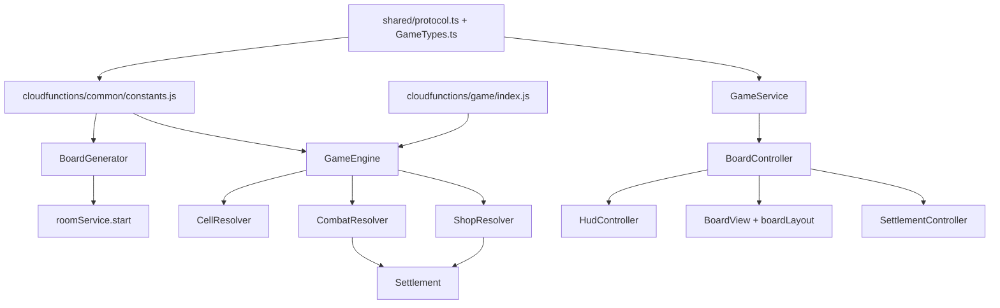

# 血量淘汰玩法改版 开发计划

---

## 1. 实现策略

### 1.1 整体方向

本次改版在现有微信小游戏 + 微信云开发架构上，将已实现的 MVP 棋盘核心从「58 格、落点触发、单次投骰、钻石/金币结算」替换为「75 格、路径触发、每回合三类行动、血量淘汰结算」。

当前代码没有 `gameMode` 多模式基础，且本迭代目标是核心玩法改版，因此建议直接替换当前棋盘玩法，而不是同时维护 MVP 与血量淘汰双模式。旧版规格仍保留在 `specs/260526-online-party-board-game/` 供追溯。

### 1.2 分阶段交付

| 阶段 | 目标 | 覆盖 AC |
|------|------|---------|
| P0 协议与常量 | 更新共享类型、服务端常量、75 格与战斗枚举 | AC-1, AC-2, AC-21 |
| P1 服务端状态机 | 实现 75 格初始化、路径触发、多行动回合、淘汰结算 | AC-1～AC-5, AC-18, AC-19, AC-21 |
| P2 装备道具与商店 | 实现装备、道具、商店库存、幸运格、陷阱 | AC-6～AC-16, AC-21 |
| P3 中立生物与战斗 | 实现玩家攻击、中立生物、掉落、伤害减免 | AC-11, AC-12, AC-17, AC-18, AC-21 |
| P4 客户端棋盘与 HUD | 更新 75 格横版布局、信息格、行动按钮、弹窗与战斗日志 | AC-3, AC-4, AC-20 |
| P5 测试与联调 | 增加 Jest 单测、云函数本地调试、双端 watch 联调 | AC-1～AC-21 |

### 1.3 计划阶段决策

| ID | 决策 | 选择 | 理由 |
|----|------|------|------|
| PD1 | 新玩法落地方式 | 直接替换当前 MVP 棋盘玩法 | 当前无 gameMode 架构，双模式会显著增加协议、UI 和测试复杂度 |
| PD2 | 75 格路径拓扑 | 视觉为横版长方形，逻辑按环形路径最短距离 | 符合 design.md 默认方案，攻击距离计算稳定 |
| PD3 | 局内/局外钻石 | 在 `games.players[].diamond` 保持局内钻石，结算不再默认写入 `users.diamond` | 钻石将用于传说商店消费，避免战斗消费影响局外资产 |
| PD4 | 商店/幸运格数量 | 75 格中建议：1 钻石、18 金币、5 事件、5 小游戏、4 金币商店、2 传说商店、5 幸运、35 普通 | 保留旧格子主体，同时为新经济系统提供足够入口 |
| PD5 | 中立生物奖励 | 首版只给最后一击奖励 | 与设计文档一致，参与奖励作为平衡预留 |
| PD6 | 掷骰规则 | 改为 1～6；移除旧版掷出 7 可再掷 | 新版额外投骰由双骰子道具承担，避免规则冲突 |

---

## 2. 代码探索结论

### 2.1 相关模块

| 模块/文件 | 位置 | 当前职责 | 本次改动 |
|----------|------|----------|----------|
| `constants.js` | `cloudfunctions/common/` | 服务端棋盘大小、骰子、圈数、回合上限等常量 | 改为 75 格、1～6 骰子，新增 HP、装备、道具、商店、伤害常量 |
| `GameEngine.js` | `cloudfunctions/common/` | `rollDice`、切换回合、圈数/行动回合结算、退出判负 | 重写为多行动回合状态机，新增 `useItem`、`attack`、`buyShopItem`、`endTurn` 等核心入口 |
| `BoardGenerator.js` | `cloudfunctions/common/` | 初始化 MVP 棋盘和玩家状态 | 生成 75 格、商店/幸运格、玩家 HP/装备/道具、陷阱和中立生物 |
| `CellResolver.js` | `cloudfunctions/common/` | 仅处理落点格效果 | 改为路径格依次触发，支持幸运格、陷阱、商店/小游戏延迟交互 |
| `Settlement.js` | `cloudfunctions/common/` | 按钻石、金币排名并写局外钻石 | 改为存活/HP/击败数/资源价值排名，不默认写局外钻石 |
| `game/index.js` | `cloudfunctions/game/` | 分发 `rollDice`、`quit`、`bluff*` action | 接入新增 action，统一持久化扩展字段 |
| `sync-cloud-common.js` | `scripts/` | 同步 common 文件到各云函数目录 | 新增 `CombatResolver.js`、`ShopResolver.js` 等 common 文件同步 |
| `protocol.ts` | `shared/` | 客户端与云函数共享协议类型 | 扩展格子类型、玩家战斗状态、道具装备、云函数 action、结算类型 |
| `GameTypes.ts` | `assets/scripts/types/` | 客户端协议镜像 | 与 `shared/protocol.ts` 同步 |
| `Constants.ts` | `assets/scripts/core/` | 客户端棋盘/回合常量 | 与服务端常量同步 |
| `GameService.ts` | `assets/scripts/network/` | 封装云函数调用 | 增加 `useItem`、`attack`、`buyShopItem`、`endTurn`、`extraRollDice` |
| `BoardController.ts` | `assets/scripts/game/board/` | 棋盘场景编排、掷骰、watch 更新、小游戏入口 | 改造为多行动控制器，处理路径事件、商店弹窗、攻击选择、道具使用 |
| `BoardView.ts` | `assets/scripts/game/board/` | 棋盘格绘制和玩家棋子展示 | 支持新格子颜色、75 格、区域和中立生物展示 |
| `boardLayout.ts` | `assets/scripts/game/board/` | 当前椭圆棋盘布局 | 改为横版长方形 75 格路径 |
| `HudController.ts` | `assets/scripts/game/board/` | 玩家金币/钻石/圈数和掷骰按钮 | 改为 HP、装备、道具、行动剩余、四个行动按钮 |
| `SettlementController.ts` | `assets/scripts/settlement/` | 展示钻石/金币排名 | 展示存活、HP、击败数、资源价值和胜者 |
| `game.test.js` | `cloudfunctions/common/__tests__/` | MVP GameEngine 单测 | 扩展/重写为 75 格、路径触发、商店、战斗、淘汰结算单测 |

### 2.2 现有代码模式

- 服务端是权威状态机：客户端只发送 action，随机、移动、格子、结算都在云函数 `common/` 中计算。
- `cloudfunctions/common/` 是 canonical 实现，再通过 `scripts/sync-cloud-common.js` 同步到各云函数目录，不能直接改某个函数目录内的 common 副本。
- 客户端 UI 基本由 TypeScript 代码创建，不依赖 prefab；新增商店、攻击选择、战斗日志应沿用 `HudController`、`BoardController` 的代码构建方式。
- 实时同步依赖云数据库 `games` watch；新增字段要进入 `toGamePatch()`，否则客户端收不到状态变化。
- 当前 `isDefeated` 已用于退出判负，可复用为 HP 淘汰状态，前端展示文案从“失败”调整为“淘汰”。

### 2.3 可复用组件

| 可复用项 | 用法 |
|----------|------|
| `GameWatcher` / `GameStateMirror` | 继续作为 `games` 文档 watch 和本地状态镜像 |
| `GameService` | 扩展而非重建云函数调用层 |
| `PawnView.animateAlongPath()` | 可复用逐格移动动画，配合服务端返回路径事件展示 |
| `BluffEngine` / `BluffController` | 小游戏格仍保留，但需要对接新回合模型 |
| `SettlementController` | 保留场景结构，替换排名字段和展示逻辑 |
| `cloudfunctions/common/__tests__` | 作为服务端核心规则回归测试入口 |

---

## 3. 依赖分析

### 3.1 模块间依赖



### 3.2 执行顺序约束

| 顺序 | 工作 | 可并行 |
|------|------|--------|
| 1 | 更新协议、常量、棋盘格/装备/道具枚举 | 客户端类型镜像可并行 |
| 2 | 改造 `BoardGenerator` 初始化 75 格和战斗状态 | 可与 UI 草图并行 |
| 3 | 实现 `CellResolver` 路径触发和延迟交互队列 | 依赖新格子类型 |
| 4 | 实现 `GameEngine` 多行动回合与 `toGamePatch()` | 依赖玩家状态与路径触发 |
| 5 | 新增 `CombatResolver`、`ShopResolver` | 可在 3/4 后并行 |
| 6 | 改造 `Settlement` 和 `game/index.js` action 分发 | 依赖服务端核心接口 |
| 7 | 扩展 `GameService`、`BoardController`、`HudController` | 依赖接口契约稳定 |
| 8 | 更新棋盘布局、格子展示、中立生物面板、结算页 | 可与 7 并行 |
| 9 | 单测、云函数本地调试、双客户端 watch 联调 | 依赖主流程完成 |

### 3.3 外部依赖

| 依赖 | 影响 |
|------|------|
| 微信云开发数据库 | `games` 文档字段扩展，无需新增 collection |
| 微信云函数 | 新 action 仍走 `game` 云函数，无需新增云函数 |
| Cocos Creator 3.8.8 | UI 继续用现有 TypeScript 组件构建 |
| Jest | 继续在 `cloudfunctions/common/` 下验证纯逻辑 |

---

## 4. 接口契约

### 4.1 后端接口

调用方式沿用 `wx.cloud.callFunction({ name: 'game', data: { action, ... } })`。

| apiKey | action | 请求参数 | 返回类型 | 说明 |
|--------|--------|----------|----------|------|
| `game.roll_dice` | `rollDice` | `{ gameId: string }` | `{ dice, steps, events, snapshot? }` | 本回合首次投骰移动；骰子为 1～6，行军鞋会追加步数 → AC-3, AC-4, AC-13 |
| `game.extra_roll_dice` | `extraRollDice` | `{ gameId: string }` | `{ dice, steps, events, snapshot? }` | 使用双骰子后额外投骰 1 次 → AC-14 |
| `game.use_item` | `useItem` | `{ gameId: string, itemType: 'DOUBLE_DICE' \| 'TRAP' \| 'MEDKIT', targetCellIndex?: number }` | `{ ok, event, snapshot? }` | 使用陷阱、双骰子、医疗包 → AC-14, AC-15, AC-16 |
| `game.attack` | `attack` | `{ gameId: string, targetType: 'PLAYER' \| 'NEUTRAL_CREATURE', targetSeat?: number, regionIndex?: 0 \| 1 \| 2 }` | `{ damage, eliminated?, drops?, snapshot? }` | 攻击玩家或中立生物；`PLAYER` 必传 `targetSeat`，`NEUTRAL_CREATURE` 必传 `regionIndex` → AC-11, AC-12, AC-17, AC-18 |
| `game.buy_shop_item` | `buyShopItem` | `{ gameId: string, shopType: 'GOLD' \| 'LEGENDARY', itemType: 'SWORD' \| 'MARCHING_SHOES' \| 'DOUBLE_DICE' \| 'TRAP' \| 'GUN' \| 'MEDKIT' }` | `{ ok, purchasedItem, snapshot? }` | 在金币/传说商店购买商品；服务端校验商品是否属于对应商店 → AC-6, AC-7, AC-8, AC-9 |
| `game.end_turn` | `endTurn` | `{ gameId: string }` | `{ ok, currentSeat, snapshot? }` | 主动结束回合并切换到下一名未淘汰玩家 → AC-3 |
| `game.quit` | `quit` | `{ gameId: string }` | `{ ok }` | 玩家退出时淘汰；只剩 1 人则结算 → AC-18 |

### 4.2 数据结构变更

#### `GamePlayer`

在现有 `position`、`gold`、`diamond`、`isOnline`、`isDefeated` 基础上扩展：

```typescript
interface GamePlayer {
  hp: number;
  maxHp: number;
  kills: number;
  weapon?: 'SWORD' | 'GUN' | 'ROCKET';
  armor?: 'HELMET' | 'ARMOR';
  shoes?: 'MARCHING_SHOES';
  items: {
    doubleDice: number;
    trap: number;
    medkit: number;
  };
  shopStock: {
    goldShopVersion: number;
    legendaryShopVersion: number;
    goldShop: Record<'SWORD' | 'MARCHING_SHOES' | 'DOUBLE_DICE' | 'TRAP', boolean>;
    legendaryShop: Record<'GUN' | 'MEDKIT', boolean>;
  };
  turnActions: {
    rolled: boolean;
    usedItem: boolean;
    attacked: boolean;
    extraRollAvailable: boolean;
    extraRolled: boolean;
  };
}
```

#### `BoardCell`

```typescript
type CellType =
  | 'NORMAL'
  | 'GOLD'
  | 'DIAMOND'
  | 'EVENT'
  | 'MINIGAME'
  | 'GOLD_SHOP'
  | 'LEGENDARY_SHOP'
  | 'LUCKY';
```

#### `GameDoc`

新增：

```typescript
interface GameDoc {
  boardSize: 75;
  pendingInteraction?: {
    seat: number;
    cellIndex: number;
    type: 'GOLD_SHOP' | 'LEGENDARY_SHOP' | 'MINIGAME';
  };
  traps: TrapState[];
  neutralCreatures: NeutralCreatureState[];
  lastEvents?: GameLastEvent[];
}
```

#### 结算

`SettlementVO` 增加或替换字段：

```typescript
interface SettlementRank {
  seat: number;
  userId: string;
  rank: number;
  isWinner: boolean;
  isEliminated: boolean;
  hp: number;
  kills: number;
  gold: number;
  diamond: number;
  resourceValue: number;
}
```

### 4.3 云数据库

无需新增 collection；`games` 文档扩展运行时字段。`users.diamond` 继续作为局外钻石余额，但血量淘汰版结算默认不再把局内钻石写入局外余额。

---

## 5. 实现方案

### 5.1 服务端实现

#### 常量与协议 → AC-1, AC-2, AC-6～AC-17, AC-21

- 将 `BOARD_SIZE` 从 58 改为 75。
- 将 `DICE_MAX` 从 7 改为 6，删除掷出最大点数可再掷的旧规则。
- 新增 `INITIAL_HP=10`、武器距离/伤害、护甲减免、商店价格、幸运格奖励池、中立生物 HP 和掉落概率。
- 更新 `shared/protocol.ts`、`assets/scripts/types/GameTypes.ts`、`assets/scripts/core/Constants.ts`，确保客户端、共享协议、服务端常量一致。

#### 棋盘初始化 `BoardGenerator` → AC-1, AC-2, AC-5

- 生成 75 格棋盘。
- 建议格子分布：1 钻石、18 金币、5 事件、5 小游戏、4 金币商店、2 传说商店、5 幸运、35 普通。
- 初始化每名玩家：`hp=10`、`maxHp=10`、`kills=0`、装备为空、道具数量为 0、行动标记全 false。
- 初始化 `neutralCreatures[3]`，每只 6 HP，分别对应 0～24、25～49、50～74。
- 初始化 `traps=[]`、`pendingInteraction=null`、`lastEvents=[]`。

#### 路径触发 `CellResolver` → AC-4, AC-5, AC-10, AC-15

- 将旧 `applyCellLanding(game, player, position, rng)` 改为 `applyPathCells(game, player, path, rng)`。
- 对路径中每个格子依次处理金币、钻石、随机事件、幸运格、陷阱。
- 若玩家因陷阱或事件 HP 清零，停止后续路径触发并检查淘汰。
- 商店和小游戏不在路径中打断移动，写入 `pendingInteraction`，移动结束后由客户端展示。
- 同次移动经过多个交互格时，优先落点格，否则取路径中最后一个交互格。

#### 多行动回合 `GameEngine` → AC-3, AC-13, AC-14, AC-18, AC-19, AC-21

- `rollDice` 校验当前回合、未淘汰、`turnActions.rolled=false`。
- 计算骰子 1～6；若装备行军鞋，单数 +1、双数 +2。
- 生成逐格路径并调用路径触发；移动完成后标记 `turnActions.rolled=true`。
- `useItem` 校验 `turnActions.usedItem=false`，按道具类型处理：
  - 双骰子：消耗 1 个，设置 `extraRollAvailable=true`。
  - 陷阱：消耗 1 个，生成 `traps` 记录。
  - 医疗包：消耗 1 个，回复 2 HP 不超过 10。
- `extraRollDice` 仅允许在 `extraRollAvailable=true` 且 `extraRolled=false` 时执行。
- `endTurn` 清理当前玩家行动状态并切换到下一名未淘汰玩家。
- `quitGame` 从“强制全局结算”调整为“该玩家淘汰，若只剩 1 人则结算”。

#### 商店 `ShopResolver` → AC-6, AC-7, AC-8, AC-9

- 新增 `ShopResolver.js` 处理商店库存、价格校验、资源扣减和物品发放。
- 金币商店商品：剑 1200、行军鞋 900、双骰子 700、陷阱 500。
- 传说商店商品：枪 8 钻石、医疗包 4 钻石。
- 库存按玩家独立记录，商品购买后置为 false；玩家下次路过对应商店时刷新该商店库存。
- 购买装备时，如果同槽位已有装备，服务端替换并记录事件，客户端负责二次确认提示。

#### 战斗 `CombatResolver` → AC-2, AC-11, AC-12, AC-17, AC-18

- 新增 `CombatResolver.js` 处理攻击距离、伤害、护甲减免、玩家淘汰和中立生物掉落。
- 玩家未装备武器时拒绝攻击。
- 玩家目标距离按 75 格环形最短距离计算。
- 伤害公式：`max(0.5, weaponDamage - armorReduction)`。
- 攻击玩家导致 HP <= 0 时标记 `isDefeated=true`，攻击者 `kills += 1`。
- 攻击中立生物时按当前区域校验；最后一击获得 2000 金币、随机道具，10% 概率获得火箭炮。
- 每次攻击后检查是否只剩 1 名存活玩家，若是则结算。

#### 结算 `Settlement` → AC-18, AC-19

- 替换钻石优先排名为：
  1. 存活优先
  2. 剩余 HP 高者优先
  3. 击败数高者优先
  4. `gold + diamond * 300` 高者优先
- 最后一名存活玩家直接胜利。
- 超时或行动回合上限结算时使用综合排名。
- 血量淘汰版默认不执行 `users.diamond += player.diamond`，除非后续单独设计局外奖励。

#### 云函数 action 分发 → AC-3, AC-6～AC-18, AC-21

- 在 `cloudfunctions/game/index.js` 增加 `useItem`、`extraRollDice`、`attack`、`buyShopItem`、`endTurn`。
- 每个 action 都读取 `games` 文档，调用 `GameEngine`，再用 `toGamePatch()` 更新。
- `toGamePatch()` 必须包含 `players`、`boardCells`、`traps`、`neutralCreatures`、`pendingInteraction`、`lastEvents`、`settlement` 等新字段。
- 更新 `scripts/sync-cloud-common.js`，同步新增 common 模块。

### 5.2 客户端实现

#### 网络与类型 → AC-3, AC-6～AC-18, AC-21

- 在 `GameService.ts` 新增 `useItem`、`extraRollDice`、`attack`、`buyShopItem`、`endTurn` 方法。
- 更新 `GameTypes.ts`，同步服务端新增字段。
- `GameWatcher` 保持 watch 流程不变，但 UI 消费方需要识别 `lastEvents`、`pendingInteraction`、`neutralCreatures`。

#### 棋盘布局与格子展示 → AC-1, AC-4, AC-5

- 将 `boardLayout.ts` 改为 75 格横版长方形路径。
- `BoardView.ts` 增加 `GOLD_SHOP`、`LEGENDARY_SHOP`、`LUCKY` 的颜色/文本。
- 增加 3 个区域的视觉提示和中立生物 HP 展示入口。
- `PawnView` 继续使用逐格动画，移动路径由服务端返回或由旧/新位置和步数推导。

#### HUD 与行动控制 → AC-3, AC-20

- `HudController.ts` 玩家卡片展示 HP、金币、钻石、武器、护甲、鞋子、道具数量、淘汰状态。
- 将单个“掷骰子”按钮改为“投骰”“道具”“攻击”“结束回合”。
- 根据 `currentSeat`、当前玩家 `turnActions`、是否有道具/武器控制按钮可用状态。
- 错误提示继续沿用当前 toast/status label 机制。

#### 商店、道具、攻击交互 → AC-6～AC-17

- 新增轻量弹窗或面板：
  - 商店弹窗：显示商品、价格、库存、资源不足状态，调用 `buyShopItem`。
  - 道具弹窗：选择双骰子、陷阱、医疗包并调用 `useItem`。
  - 攻击目标选择：列出距离内玩家和当前区域中立生物，调用 `attack`。
- `pendingInteraction` 为商店时，移动动画结束后弹出商店；为小游戏时进入现有吹牛流程。
- 战斗日志展示攻击、减免、陷阱、淘汰和掉落。

#### 小游戏与结算 → AC-5, AC-18, AC-19

- 吹牛小游戏仍由 `MINIGAME` 格触发，但结束后应回到同一套多行动回合模型。
- `SettlementController.ts` 改为展示胜者、HP、击败数、金币、钻石和资源价值，不再强调局外钻石获得。

### 5.3 数据库与文档

- 更新 `specs/260529-combat-board-game-rework/ddl-sql.md` 或后续新增数据库配置说明时，记录 `games` 文档新增字段。
- `cloud/database/security-rules/games.json` 仍保持客户端只读、云函数写入。
- 若后续决定恢复局外奖励，需要另行设计 `users.diamond` 增量规则。

---

## 6. 风险与注意事项

| 风险 | 影响 | 缓解 |
|------|------|------|
| 状态机改动大 | `GameEngine`、前端 HUD、结算都会受影响 | 分 P0～P5 小步提交，优先服务端单测 |
| 路径触发事件过多 | 客户端动画和 toast 可能拥挤 | 服务端返回 `lastEvents[]`，客户端按动画节奏展示 |
| 局内钻石消费与局外钻石混淆 | 玩家误以为消费长期资产 | 协议和 UI 明确“局内钻石”，结算不写 `users.diamond` |
| 商店库存 per-player 状态复杂 | 容易出现库存不刷新或跨玩家污染 | 库存放在玩家状态内，并用路过商店刷新 |
| 中立生物抢尾刀 | 玩家体验可能偏投机 | 首版按设计实现，测试后再启用参与奖励 |
| 旧版吹牛回合接续 | 与多行动回合可能冲突 | 明确小游戏结束后回到当前规则并由服务端设置下一行动状态 |
| common 同步遗漏 | 云函数部署后运行旧代码 | 更新 `sync-cloud-common.js` 并在部署前执行同步 |
| 测试用例旧断言失效 | MVP 单测会大量失败 | 按新版 AC 重写核心断言，不保留旧结算规则断言 |

---

## 7. 验证策略

| 模块 | 验证方式 |
|------|----------|
| 协议与常量 | TypeScript 编译检查；服务端常量与客户端常量人工核对 |
| `BoardGenerator` | Jest 校验 75 格、格子数量、3 个中立生物、玩家初始状态 |
| `CellResolver` | Jest 覆盖路径金币/钻石/幸运/陷阱/商店延迟交互 |
| `GameEngine` | Jest 覆盖多行动顺序、重复行动拒绝、结束回合、双骰子额外移动 |
| `ShopResolver` | Jest 覆盖价格、库存、刷新、资源不足、装备替换 |
| `CombatResolver` | Jest 覆盖距离、伤害减免、最低伤害、淘汰、中立生物掉落 |
| `Settlement` | Jest 覆盖最后存活胜利和超时综合排名 |
| 云函数 | 微信开发者工具本地调试 `game` action |
| 客户端 | 两个开发者工具实例 watch 同一 `gameId`，验证移动、攻击、购买和淘汰同步 |
| 验收 | 按 `design.md` AC-1～AC-21 手动走查 |
